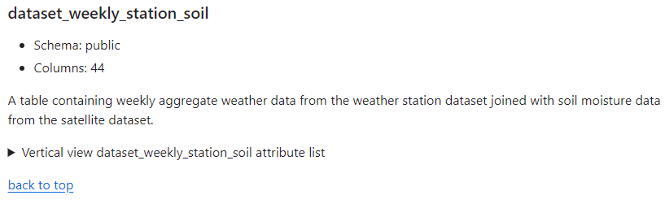

<div align='center'>

# DB-Overflow (PostgreSQL)
### Because production databases are just *slightly* bigger

</div>

<br>
<br>

#### Sample picture:

___

<div align='right'>



</div>

____

<br>

## Setup:
1. Create a virtual environment with ```python -m venv ./env```
2. Step into it with ```cd env/Scripts``` run ```activate``` then step out with ```cd ../../```
3. Install dependencies with ```pip install -r requirements.txt```
4. Load environment variables based on the .env template (.env.template in the projects root) as per your postgres setup 
5. Run the program with ```cd src``` and ```python main.py```
